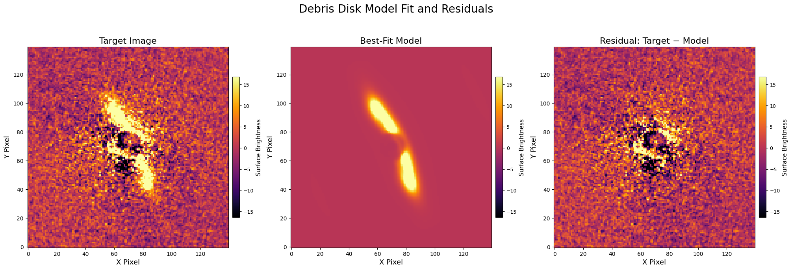

# Summary

`GRaTer-JAX` is a Python package for modeling debris disks, disks of dust around stars that provide important clues about the formation, structure, and evolution of planetary systems. `GRaTer` is a debris disk modeling framework originally developed for generating and fitting models of optically thin, axisymmetric dust disks. Its name stands for Generator of Ring-like, Axisymmetric, optically Thin dust disks for Regularized fitting. JAX is a Python package for high-performance computing that implements just-in-time compilation and auto-differentiation, enabling significant speedups in forward modeling workflows.

{ width=115% }

`GRaTer-JAX` delivers a more powerful, efficient, and robust debris disk modeling framework than previous tools. Its JAX-based backend provides orders-of-magnitude speedups and analytic gradients, while its intuitive and extensible API unifies forward modeling, optimization, and inference within a single workflow. Combined with key additions to its disk model, it enables more advanced debris disk modeling, enabling research that was previously impossible.

# Statement of Need

Debris disks are circumstellar belts of dust and planetesimals, shaped by a combination of stellar forces, dynamical interactions, and collisional processes [@Hughes2018]. Their observed morphologies provide key information for the architecture, composition, and evolutionary history of planetary systems. In exoplanet astronomy, the study of debris disks therefore plays a key role in understanding planet formation and evolution. However, imaging observations of such disks are often limited by noise, resolution, and instrumental effects, making direct interpretation of data challenging [@Hughes2018]. As a result, quantitative modeling is essential for extracting insight from observations.

For the past 25 years, the *Generalized Radial Transporter (GRaTer)* framework [@augereau1999] has provided an analytical foundation for debris disk modeling and has been widely used to study observed disk morphologies and infer physical disk properties (e.g. [@Hughes2018]). A key component of the `GRaTer` model is the scattering phase function (SPF), which describes how dust grains scatter starlight toward the observer. Because the SPF is directly related to dust grain properties, it can provide valuable insight into grain composition, size distribution, and possible signs of recent collisional activity. Accurately modeling these effects is therefore important for researchers seeking to extract physically meaningful information from high-contrast imaging data.

`GRaTer-JAX` was created to support this scientific need by providing a modern, open-source framework for debris disk forward modeling and fitting. It is designed for researchers working on debris disk imaging who need faster model evaluation, gradient-based optimization, and more flexible parameterizations than are readily available in existing implementations. By leveraging JAX [@Bradbury2018; @Frostig2018], including GPU acceleration, just-in-time compilation, and automatic differentiation, `GRaTer-JAX` makes it practical to fit more than 25 parameters simultaneously, including flexible spline-based SPF representations. This enables more detailed and expressive modeling and broadens the range of debris disk structures and dust-scattering behaviors that can be studied in practice.

# State of the Field

Existing implementations of the `GRaTer` framework, one of the main examples being `VIP` [@GomezGonzalez2017], have made debris disk forward modeling more accessible, but they remain limited in several important ways. Historically, debris disk modeling has been substantially constrained by computation time, restricting the number of disk parameters that can be explored and reducing the flexibility of model fitting [@Esposito2020]. Prior implementations have also generally relied on a small number of rigid SPF parameterizations, limiting their ability to capture more complex or unexpected scattering behavior present in real debris disks. These limitations motivate the development of a new implementation rather than a small extension of existing tools.

First, prior implementations are comparatively inefficient. Referencing benchmark tests from the SpeedComparision notebook in the `GRaTer-JAX` repository, a basic `VIP` debris disk model requires approximately 104 milliseconds to generate. While this may appear modest, it becomes burdensome in workflows that require thousands of iterations, such as model fitting and parameter exploration. `GRaTer-JAX` achieves a runtime of 2.67 milliseconds, corresponding to a 39$\times$ speedup for the same model generation without sacrificing accuracy. As model complexity increases, this speedup becomes even more pronounced.

Second, existing implementations lack automatic differentiation. Without access to analytic gradients, users must rely on numerical gradients, which are both computationally expensive and less accurate. Benchmark results show that computing a numerical gradient for a `VIP` model with eight parameters requires approximately 1.71 seconds. This severely limits gradient-based fitting workflows. In contrast, `GRaTer-JAX` computes analytic gradients for a larger twelve-parameter model in 29.1 milliseconds, corresponding to a 59$\times$ speedup. As with forward modeling, these performance gains increase with model complexity.

Third, existing tools lack built-in support for modern optimization workflows. `GRaTer-JAX` addresses this through its `Optimizer` class, which provides built-in gradient descent and Markov Chain Monte Carlo (MCMC) support. This framework also integrates useful observational components such as throughput corrections for a coronagraphic mask of the user’s choice and convolution with a point spread function (PSF). By bringing these capabilities into a unified modeling workflow, `GRaTer-JAX` makes advanced fitting procedures substantially more practical for debris disk studies.

Fourth, `GRaTer-JAX` expands the scientific flexibility of debris disk modeling by making it practical to explore parameters and model features that are often fixed or simplified in existing tools, such as the radiation pressure ratio $\beta$, the flaring parameter, and the scattering phase function (SPF). In particular, its support for spline-based SPF fitting enables more precise modeling of dust-scattering behavior. This allows users to better probe parameter degeneracies and test a wider range of possible disk morphologies than before.

All in all, `GRaTer-JAX` provides solutions to multiple existing challenges in debris disk forward modeling, enabling faster, more flexible, and more robust scientific analysis of debris disk systems.

# Software Design

The software design of `GRaTer-JAX` was guided by a central trade-off: exposing the full flexibility and performance of JAX while providing an interface that is practical for astronomers using debris disk models in real research workflows. A purely low-level JAX interface would maximize flexibility, but it would also require users to manually assemble model components, manage parameter transformations, and understand JAX-specific implementation details. While powerful, that approach would create a substantial usability barrier for researchers whose primary goal is scientific modeling rather than software engineering. On the other hand, a highly simplified interface could make common workflows easier, but at the cost of limiting extensibility and making it difficult to support more advanced models. `GRaTer-JAX` was therefore designed as a layered system that balances performance, usability, and extensibility.

The first layer consists of the low-level JAX-based modeling components. This layer includes the core disk generation routines, scattered light disk class, scattering phase function (SPF) models, and point spread function (PSF) handling. These components are implemented in a way that is compatible with JAX transformations such as just-in-time compilation, vectorization, and automatic differentiation. A key design decision here was to have a base JAX class to represent model components as structured classes while also supporting flattening and unflattening to JAX arrays. This enables complex object-based models to remain differentiable and optimizable within the JAX ecosystem. The advantage of this approach is that it preserves both modularity and computational efficiency. Researchers can now easily swap in different physical components without breaking JAX optimized calculations and gradient-based workflows.

However, exposing only this layer to users would have made the package difficult to use. Disk models involve many interacting components, and requiring users to manually assemble them would make routine fitting cumbersome and error-prone. To address this, `GRaTer-JAX` introduces a second layer of objective functions: `objective_model`, `objective_fit`, `objective_grad`, and `objective_fit_grad`. These functions abstract the model internals by taking model choices and parameter values as input, selecting the correct JAX routines, and returning the corresponding model image, fit statistic, or gradient. This layer slightly constrains direct access to the internals, but in return it greatly simplifies usage and reduces mistakes in model construction.

The third layer is the `Optimizer` class, which provides a unified interface for parameter estimation and inference. In debris disk modeling, forward modeling alone is rarely sufficient; researchers also need optimization, sampling, and instrumental corrections. By integrating gradient descent and Markov Chain Monte Carlo (MCMC) into the same framework, `GRaTer-JAX` allows the same model definitions to be used consistently across forward modeling, optimization, and Bayesian inference. This reduces duplicated code and improves reproducibility. The optimizer also includes research-specific operations such as coronagraphic throughput corrections and PSF convolution, which are necessary for comparing physical models to real observations.

`GRaTer-JAX`'s layered architecture is key because debris disk modeling is both computationally expensive and scientifically iterative. Researchers often move from simple forward models to more advanced fitting and inference. The low-level JAX layer provides speed and differentiability, the objective-function layer improves usability, and the optimizer layer connects the framework to real observational analysis. Together, these choices make the software efficient, flexible, and practical for research use. For further information, review the documentation, [GRaTer-JAX Documentation](https://grater-jax.readthedocs.io).

Common workflows follow the flow chart below:

{ width=115% }

# Research Impact Statement

`GRaTer-JAX`'s improved speedups and additions, as described before, enable large scale precise parameter fitting. This allows more robust disk model fitting that includes new parameters such as splines, enabling more in depth research. When models are more powerful, researchers can avoid having to make fixed assumptions, and can obtain more novel and trustworthy results for individual disks. These, in turn, help us better understand how debris disks evolve, what their compositions are like, and whether unseen planets may be shaping them.

This potential for more powerful models has already been realized in a recent ongoing paper, **GPU-Enabled Debris Disk Modeling with GRaTer-JAX I: A Uniform Analysis of Gemini Planet Imager H-band Polarimetric Data** `GRaTer-JAX` is being used as the primary modeling engine in the paper's analysis of Gemini Planet Imager *H*-band polarimetric debris disk observations. In that work, it is used to forward-model the disk images, fit twelve or more debris disk parameters together with spline-based scattering phase functions, and sample posterior distributions with MCMC across a large target sample.

Additionally, work on `GRaTer-JAX` has also led to more accessibility both through its new, intuitive API and workflows, and through the development of a web app. [GRaTer Disk Image Generator](https://scattered-light-disks.vercel.app/), was made to complement the framework. It provides researchers a simple interface to model dust debris disk images using elements of the GRaTer-JAX package allowing them to workshop disks and try out different geometries before more detailed fitting and also build intuition for how different disk parameters change the observed morphology.

# AI Usage Disclosure

AI was used in the making of this software, but only in a limited capacity. LLM tools such as ChatGPT v4.1-v5.4, Claude Code v2.1.87 with Sonnet 4.6, and Gemini 2.5 Pro were used to assist with some refactoring, debugging, tutorial documentation, and model validation. However, all of the architecture design decisions were made by humans with the goal of making it as intuitive and powerful as possible to human users.

For this paper, AI was used to help with editing, generating latex for formatting assistance, and fixing specific grammar and wording issues. AI was not used for creating and expressing the core ideas and arguments of the paper. Additionally, all AI-assisted corrections were reviewed and verified by the authors for validity and relevance before being included.

Looking ahead, continued advances in AI tools will further increase the utility of `GRaTer-JAX`. Because the package is extensible, future users may be able to use LLMs to generate compatible extensions from high-level model descriptions, lowering the effort required to test new ideas and making debris disk modeling more accessible.

# Acknowledgments

This material is based upon work supported by:

National Science Foundation Astronomy \& Astrophysics Postdoctoral Fellowship Award No. 2401654 for author BLL. Any opinions, findings, and conclusions or recommendations expressed in this material are those of the authors(s) and do not necessarily reflect the views of the National Science Foundation.

NASA Hubble Fellowship grant HST-HF2-51547.001-A awarded by the Space Telescope Science Institute for author J.N.A, which is operated by the Association of Universities for Research in Astronomy.

Packages used: `numpy`, `scipy`, `matplotlib`, `pandas`, `astropy`, `astroquery`, `poppy`, `stsynphot`, `synphot`, `pysiaf`, `emcee`, `arviz`, `corner`, `xarray`, `h5py`, `jax`, `jaxlib`, `jaxopt`, and `tqdm`
