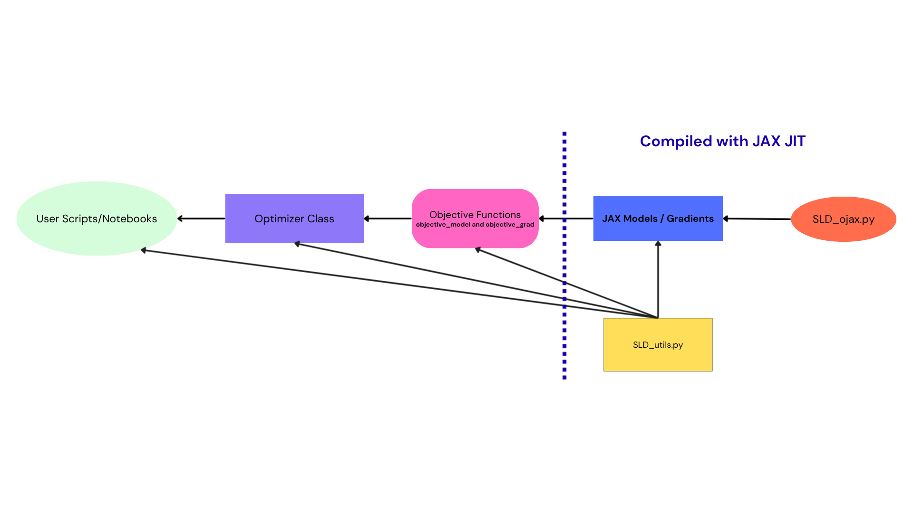

# Keywords

Python; Astronomy; Debris Disks; JAX; Machine Learning

# Summary

`GRaTer-JAX` is a Python package for modeling debris disks, disks of dust around stars that provide important clues about the formation, structure, and evolution of planetary systems. `GRaTer` (**G**enerator of **R**ing-like, **a**xisymmetric, optically **T**hin dust disks for **r**egularized fitting) is a debris disk modeling framework originally developed for generating and fitting models of optically thin, axisymmetric dust disks. JAX is a Python package for high-performance computing that implements just-in-time compilation and auto-differentiation, enabling significant speedups in forward modeling workflows.

`GRaTer-JAX` delivers a more powerful, efficient, and robust debris disk modeling framework than previous tools. Its JAX-based backend provides orders-of-magnitude speedups and analytic gradients, while its intuitive and extensible API unifies forward modeling, optimization, and inference within a single workflow. Combined with key additions to its disk model, it is capable of more advanced debris disk modeling, enabling research that was previously impossible such as explorations of additional morphological parameters and disk composition via scattering phase functions.

# Statement of Need

Debris disks are circumstellar belts of dust and planetesimals, shaped by a combination of stellar forces, dynamical interactions, and collisional processes [@Hughes2018]. Their observed morphologies provide key information for understanding the architecture, composition, and evolutionary history of planetary systems. However, imaging observations of such disks are often limited by noise, resolution, and instrumental effects, making direct interpretation of data challenging [@Hughes2018]. As a result, forward modeling (e.g. Figure \autoref{fig:diskfit}) is essential for extracting insight from observations.

![GRaTer-JAX Disk Fit of HD 115600 in H-band polarimetry from the Gemini Planet Imager debris disk survey [@Esposito2020].\label{fig:diskfit}](GJFit.png)

For the past 25 years, the *Generalized Radial Transporter (GRaTer)* framework [@augereau1999] has provided an analytical foundation for debris disk modeling and has been widely used to study observed disk morphologies and infer physical disk properties (e.g. [@Hughes2018]). A key component of the `GRaTer` model is the scattering phase function (SPF), which describes how dust grains scatter starlight toward the observer. Because the SPF is directly related to dust grain properties, it can provide valuable insight into grain composition, grain size distribution, and grain porosity. However, disk modeling efforts have been historically limited by prohibitively long computation times, requiring assumptions about disk properties to simplify the models.

`GRaTer-JAX` was created to address the computational limits in disk modeling by providing a fast, modern, open-source framework for debris disk forward modeling and fitting. It is designed for astronomers/researchers working on debris disk imaging who need faster model evaluation, gradient-based optimization, and more flexible parameterizations than are readily available in existing implementations. By leveraging JAX [@Bradbury2018; @Frostig2018], including GPU acceleration, just-in-time compilation, and automatic differentiation, `GRaTer-JAX` makes it practical to fit more than 25 parameters simultaneously, including flexible spline-based SPF representations. This enables more detailed and expressive modeling and broadens the range of debris disk structures and dust-scattering behaviors that can be studied in practice.

# State of the Field

Historically, debris disk modeling has been substantially constrained by computation time, restricting the number of disk parameters that can be explored and reducing the flexibility of model fitting [@Esposito2020]. Prior implementations of the SPF have also generally relied on an empirical framework known as the Henyey-Greenstein function [@henyey1941diffuse], which is known to be a poor descriptor of the observed scattering behavior of disks [@Hughes2018]; this has limited previous models' ability to capture more complex or unexpected scattering behavior present in real debris disks. Existing implementations of the `GRaTer` framework, one of the main examples being the Vortex Image Processing package (`VIP`, [@GomezGonzalez2017]), have made debris disk forward modeling more accessible, but they remain limited in several important ways further described below. These limitations motivate the development of a new implementation rather than a small extension of existing tools.

First, prior implementations are comparatively inefficient. As shown in benchmark tests from the `GRaTer-JAX` repository, a basic `VIP` debris disk model requires approximately 127 milliseconds to generate. While this may appear modest, it becomes burdensome in workflows that require thousands of iterations, such as model fitting and parameter exploration. `GRaTer-JAX` achieves a runtime of 2.36 milliseconds, corresponding to a 54$\times$ speedup for the same model generation without sacrificing accuracy. As model complexity increases, this speedup becomes even more pronounced. This increase in speed also allows users to fit for additional parameters that were previously inaccessible due to long computation times.

Second, existing implementations lack automatic differentiation. Without access to analytic gradients, users must rely on numerical gradients, which are both computationally expensive and less accurate. Benchmark results show that computing a numerical gradient for a `VIP` model with eight parameters requires approximately 2.04 seconds. This severely limits gradient-based fitting workflows. In contrast, `GRaTer-JAX` computes analytic gradients for a larger twelve-parameter model in 16.8 milliseconds, corresponding to a 121$\times$ speedup. As with forward modeling, these performance gains increase with model complexity.

Third, existing tools lack built-in support for modern optimization workflows. `GRaTer-JAX` addresses this through its `Optimizer` class, which provides built-in gradient descent and Markov Chain Monte Carlo (MCMC) support. This framework also integrates useful observational components such as throughput corrections for a coronagraphic mask of the user’s choice and convolution with a point spread function (PSF). By bringing these capabilities into a unified modeling workflow, `GRaTer-JAX` makes advanced fitting procedures substantially more practical and accessible for debris disk studies.

All in all, `GRaTer-JAX` provides solutions to multiple existing challenges in debris disk forward modeling, enabling faster, more flexible, and more robust scientific analysis of debris disk systems.

# Software Design

The software design of `GRaTer-JAX` was guided by a central trade-off: exposing the full flexibility and performance of JAX while providing an interface that is practical for astronomers using debris disk models in real research workflows. A purely low-level JAX interface would maximize flexibility, but it would also require users to manually assemble model components, manage parameter transformations, and understand JAX-specific implementation details. While powerful, that approach would create a substantial usability barrier for researchers whose primary goal is scientific modeling rather than software engineering. On the other hand, a highly simplified interface could make common workflows easier, but at the cost of limiting extensibility and making it difficult to support more advanced models. `GRaTer-JAX` was therefore designed as a layered system that balances performance, usability, and extensibility; this architecture is visualized in a block diagram in Figure \autoref{fig:block-diagram}.

`GRaTer-JAX`'s layered architecture is key because debris disk modeling is both computationally expensive and scientifically iterative. Researchers often move from simple forward models to more advanced fitting and inference. The low-level JAX layer provides speed and differentiability, the objective-function layer improves usability, and the optimizer layer connects the framework to real observational analysis. Together, these choices make the software efficient, flexible, and practical for research use.

# Research Impact Statement

`GRaTer-JAX`'s improved speedups and additions, as described before, enable large scale precise parameter fitting. When models are more powerful, researchers can avoid having to make fixed assumptions, can analyze larger samples of disks in a uniform fashion to see population-level trends, and can obtain more novel and trustworthy results for individual disks. These, in turn, help us better understand how debris disks evolve, what their compositions are like, and whether unseen planets may be shaping them.

A key advancement enabled by `GRaTer-JAX` is the ability to fit the SPF with a flexible spline, as opposed to the Henyey-Greenstein function [@henyey1941diffuse], which is parameterized by only the asymmetry parameter $g$ and has multiple known shortcomings [@Hughes2018]. The free parameters of the SPF under our new framework are the y-values of the spline knots; the x-values of the spline knots are evenly spaced between 0$^\circ$ and 180$^\circ$, or between $\theta_{\rm sca,min}$ and $\theta_{\rm sca,max}$ if using inclination-based bounds, with a knot fixed to 1 at 90$^\circ$ to normalize the SPF and avoid degeneracy with the flux scaling. The number of knots $n_k$ is determined by the user. With this new framework, researchers have the potential to finally capture the true scattering behavior of debris disks, therefore providing insight into their grain properties.

This potential for more powerful models has already been realized in a recent analysis of *H*-band polarimetric debris disk images from the Gemini Planet Imager (GPI) [@macintosh2008gemini; @LewisEtAl2026], where `GRaTer-JAX` is being used as the primary modeling engine. In @LewisEtAl2026, it is used to forward-model the disk images, fit twelve or more debris disk parameters together with spline-based scattering phase functions, and sample posterior distributions with MCMC across a large target sample, revealing population-level trends in planet formation/evolution.

Additionally, work on `GRaTer-JAX` has not only made this modeling more accessible through its new, intuitive API and workflows, but also through the development of a web app to help researchers develop an intuition for how different disk parameters change the observed morphology. [GRaTer Disk Image Generator](https://scattered-light-disks.vercel.app/) provides researchers a simple interface to visualize debris disk images using elements of the GRaTer-JAX package, allowing them to workshop disks and try out different geometries before more detailed fitting.

# AI Usage Disclosure

AI was used in the making of this software, but only in a limited capacity. LLM tools (ChatGPT v4.1-v5.4, Claude Code v2.1.87 with Sonnet 4.6, and Gemini 2.5 Pro) were used to assist with some refactoring, debugging, tutorial documentation, and model validation, although the bulk of the code was written before these tools gained popularity in recent months. All of the architecture design decisions were made by humans with the goal of making it as intuitive and powerful as possible to human users.

For this paper, AI was used to help with editing, generating latex for formatting assistance, and fixing specific grammar and wording issues. AI was not used for creating and expressing the core ideas and arguments of the paper. Additionally, all AI-assisted corrections were reviewed and verified by the authors for validity and relevance.

Looking ahead, continued advances in AI tools will further increase the utility of `GRaTer-JAX`. Because the package is extensible, future users may be able to use LLMs to generate compatible extensions from high-level model descriptions, lowering the effort required to test new ideas and making debris disk modeling more accessible.

# Acknowledgments

This material is based upon work supported by National Science Foundation Astronomy & Astrophysics Postdoctoral Fellowship Award No. 2401654 for author BLL. Any opinions, findings, and conclusions or recommendations expressed in this material are those of the authors(s) and do not necessarily reflect the views of the National Science Foundation. Author J.N.A acknowledges support from NASA through Hubble Fellowship grant HST-HF2-51547.001-A awarded by the Space Telescope Science Institute, which is operated by the Association of Universities for Research in Astronomy.

Packages used: `numpy`, `scipy`, `matplotlib`, `pandas`, `astropy`, `astroquery`, `poppy`, `stsynphot`, `synphot`, `pysiaf`, `emcee`, `arviz`, `corner`, `xarray`, `h5py`, `jax`, `jaxlib`, `jaxopt`, and `tqdm`

# References

